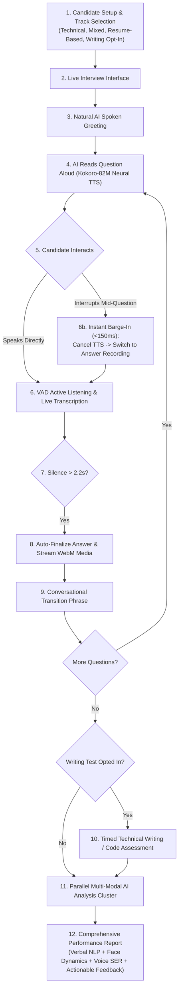
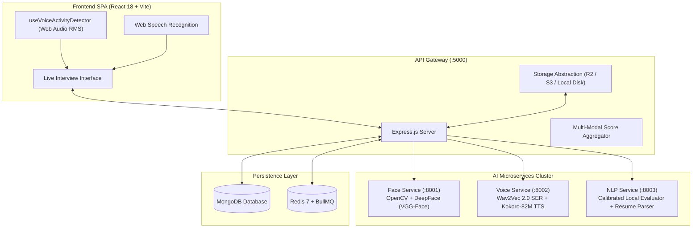

# InterviewAI — Autonomous Multi-Modal AI Interview Platform

<p align="center">
  
  
  
  
  
  
</p>

---

## 💡 What is InterviewAI?

**InterviewAI** is a real-time, autonomous AI interview simulator and evaluation platform. Unlike conventional quiz applications that rely on manual button clicks, InterviewAI delivers an **organic, conversational interview experience**. 

The AI greets the candidate, speaks questions aloud with studio-quality neural voices, continuously monitors for candidate speech, **yields immediately when interrupted (barge-in)**, detects answer completion through silence analysis, and automatically progresses through the interview. Upon completion, a parallelized multi-modal AI cluster evaluates the candidate across **facial dynamics**, **vocal prosody (speech emotion)**, **conceptual technical accuracy**, and **written coding solutions**.

```markdown
<!-- 📸 SCREENSHOT PLACEHOLDER: Hero / Live AI Interview Interface -->
```

---

## ⚡ Why InterviewAI? (Key Technical Differentiators)

| Feature | Typical Interview Practice Apps | InterviewAI |
| :--- | :--- | :--- |
| **Conversational Flow** | Turn-based buttons (*"Click Record"*, *"Click Next"*) | **Continuous, autonomous state machine with natural transitions** |
| **Candidate Interruption** | Impossible; audio plays to completion | **Real-time Acoustic/Speech hybrid VAD barge-in (<150ms)** |
| **NLP Answer Scoring** | Generic LLM prompt (*"Rate 1-10"*) prone to score inflation | **Deterministic local NLP engine with strict correctness floor gating** |
| **Multi-Modal Analytics** | Text-only or superficial keyword checks | **Tri-modal AI: Facial expression (DeepFace), Vocal emotion (Wav2Vec 2.0), & NLP** |
| **Question Bank** | Generic 10–20 static questions | **285-question dataset with per-user repetition tracking (`QuestionHistory`)** |
| **Resume Intelligence** | Manual topic selection | **PDF/DOCX parsing with deep-dive architectural question synthesis** |
| **Deployment Modes** | Cloud-only | **Dual-target: Cloud (Docker Compose) & Campus LAN Self-Hosted (PM2)** |

---

## 🔄 End-to-End Interview Lifecycle



---

## 📸 Visual Product Tour

### 1. Interview Setup & Track Customization
```markdown
<!-- 📸 SCREENSHOT PLACEHOLDER: Interview Setup Page (Track selection, subject chips, question count slider) -->
```

### 2. Live Conversational AI Interview
```markdown
<!-- 📸 SCREENSHOT PLACEHOLDER: Live Interview Room with Real-Time Audio Visualizer & Webcam Preview -->
```

### 3. Real-Time Candidate Speaking & Barge-In Waveform
```markdown
<!-- 📸 SCREENSHOT PLACEHOLDER: Active Speaking State with Live Audio RMS Waveform Animation -->
```

### 4. Optional Technical Writing Assessment
```markdown
<!-- 📸 SCREENSHOT PLACEHOLDER: Technical Writing / Coding Interface with Live Timer & Syntax Styling -->
```

### 5. Multi-Modal Comprehensive Performance Report
```markdown
<!-- 📸 SCREENSHOT PLACEHOLDER: Report Page (Overview Radar, Verbal NLP Score, Vocal Prosody, Face Visuals) -->
```

### 6. Faculty Management Hub & Analytics
```markdown
<!-- 📸 SCREENSHOT PLACEHOLDER: Faculty Dashboard (Placement drives, question bank CRUD, bulk CSV upload) -->
```

---

## 🏗️ High-Level System Architecture



---

## 🧠 Core Subsystem Deep-Dives

### 1. The Autonomous Conversational State Machine
Implemented as an explicit single-owner state machine in [`frontend/src/pages/LiveInterviewPage.jsx`](file:///C:/Workspace/Workspace/InterviewApp/frontend/src/pages/LiveInterviewPage.jsx). Uses an atomic `generationIdRef` counter to eliminate asynchronous audio race conditions and stale callback executions when audio is cancelled mid-sentence.

### 2. Calibrated Local NLP Answer Evaluator (0% Score Inflation Guarantee)
Located in [`ai-services/nlp-service/main.py`](file:///C:/Workspace/Workspace/InterviewApp/ai-services/nlp-service/main.py), the engine evaluates semantic coverage across technical keyword stems and multi-word concept sentences. Strict correctness floor gating guarantees that fluent but incorrect answers, prompt echoes, and buzzword dumps receive genuine failing scores ($\le 20\%$).

### 3. Multi-Modal AI Microservices Cluster
- **Face Service (`:8001`)**: Samples video frames via OpenCV, computes 7 emotional probabilities using DeepFace, tracks attention/eye contact, and verifies candidate identity via VGG-Face.
- **Voice Service (`:8002`)**: Analyzes audio prosody with Wav2Vec 2.0 PyTorch model and synthesizes $<150\text{ms}$ natural voice audio via Kokoro-82M ONNX.
- **NLP Service (`:8003`)**: Runs local concept coverage, PDF/DOCX resume extraction, and dynamic project follow-up generation.

---

## 🛠️ Technology Stack

| Domain | Technologies |
| :--- | :--- |
| **Frontend** | React 18, Vite, TailwindCSS, Zustand, React Router v6, Lucide Icons |
| **Audio & Speech** | Web Audio API (`AnalyserNode`), Web Speech Recognition API, Kokoro-82M ONNX Neural TTS |
| **Backend** | Node.js (ES Modules), Express.js, Mongoose ODM, BullMQ |
| **AI / ML** | Python 3.11, FastAPI, PyTorch, DeepFace, OpenCV, Wav2Vec 2.0, ONNX Runtime |
| **Databases** | MongoDB (Users, Sessions, Questions, QuestionHistory), Redis 7 (Queues & Caching) |
| **Storage** | Cloudflare R2 / AWS S3 (with transparent local filesystem fallback) |
| **Deployment** | Docker, Docker Compose, Nginx, PM2 (`ecosystem.college.config.cjs`), PowerShell Automation |

---

## 🚀 Quick Start Guide

### Prerequisites
- Node.js 18+ & npm
- Python 3.11+
- MongoDB & Redis (Local or Cloud Instances)

### 1. Clone & Configure Environment
```bash
git clone https://github.com/Noob-code7/InterviewApp.git
cd InterviewApp

cp backend/.env.example backend/.env
cp ai-services/nlp-service/.env.example ai-services/nlp-service/.env
cp ai-services/voice-service/.env.example ai-services/voice-service/.env
cp ai-services/face-service/.env.example ai-services/face-service/.env
```

### 2. Launch with Docker Compose (Recommended)
```bash
docker compose up -d --build
```
Access the application at `http://localhost:5173`.

---

## 📚 Complete Technical Documentation

| Document | Description |
| :--- | :--- |
| 🏛️ [System Architecture](docs/ARCHITECTURE.md) | Complete multi-service architecture, data flows, and security model |
| 🎙️ [Conversational Engine](docs/CONVERSATIONAL_ENGINE.md) | State machine lifecycle, VAD, candidate barge-in, and race condition guards |
| 🧠 [Local NLP Engine](docs/NLP_ENGINE.md) | Dual-pillar concept matching, correctness floor gating, and strictness rules |
| 👁️ [Multi-Modal AI Pipelines](docs/AI_PIPELINES.md) | DeepFace vision pipeline, Wav2Vec 2.0 SER, and Kokoro-82M ONNX TTS |
| 📄 [Resume Intelligence](docs/RESUME_INTELLIGENCE.md) | PDF/DOCX document parsing and personalized question synthesis |
| 📦 [Storage & Media](docs/STORAGE_AND_MEDIA.md) | Cloudflare R2 / S3 abstraction, local disk fallback, and ephemeral cleanup |
| 🧪 [Testing & Verification](docs/TESTING_AND_VERIFICATION.md) | Automated regression suites, score parity tests, and physical acoustic checklist |
| 🚢 [Deployment Guide](docs/DEPLOYMENT.md) | Cloud VPS (Docker Compose) vs Campus LAN Self-Hosted (PM2 + SPA Serving) |
| 🔌 [REST API Specification](docs/API.md) | Endpoint specifications for Auth, Sessions, Storage, Analysis, and TTS |

---

## 📜 License
This project is open-source under the MIT License.
