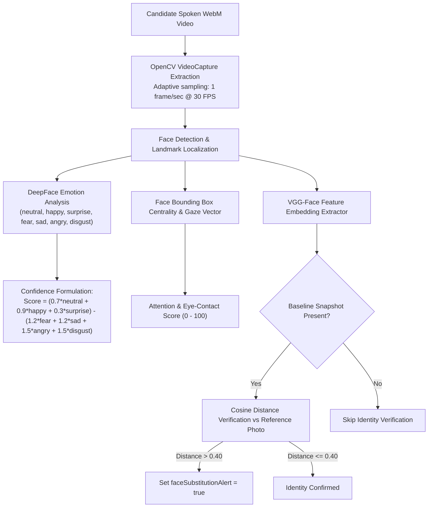

# Tri-Modal AI Microservices Cluster — InterviewAI

## 1. Microservice Topology

InterviewAI coordinates three dedicated Python FastAPI microservices running in isolated processes:

```text
ai-services/
├── face-service/     (:8001)  -> OpenCV + DeepFace (VGG-Face)
├── voice-service/    (:8002)  -> Wav2Vec 2.0 PyTorch SER + Kokoro-82M ONNX TTS
└── nlp-service/      (:8003)  -> Calibrated Local NLP + Resume Parser + LLM Router
```

---

## 2. Computer Vision & Face Analysis Pipeline (`:8001`)



### Docker Pre-Bake & Zero Cold-Start Latency
DeepFace downloads `facial_expression_model_weights.h5` (~50MB) and `vgg_face_weights.h5` (~140MB) on first execution. In InterviewAI:
1. Weights are pre-downloaded during `docker compose build` inside the Dockerfile.
2. Models are eagerly built into RAM upon container startup via `@app.on_event("startup")`, reducing the first candidate's latency from **60s to 1.2s**.

---

## 3. Speech Emotion Recognition & Neural TTS Pipeline (`:8002`)

### 3.1 Wav2Vec 2.0 Speech Emotion Recognition (SER)
- **Model Architecture**: Fine-tuned Wav2Vec 2.0 transformer (`best_model_path.pth`).
- **Input**: 16kHz mono PCM waveform.
- **Acoustic Features**: Computes pitch stability, speech jitter, speaking rate, and vocal energy distribution.
- **Output Metrics**: `confidenceScore` ($0-100$), `nervousnessScore` ($0-100$), and `toneDistribution`.

### 3.2 Kokoro-82M ONNX Neural TTS
- **Engine**: Kokoro-82M fp16 ONNX model (`kokoro-v1.0.fp16.onnx` + `voices-v1.0.bin`).
- **Performance**: High-fidelity 24kHz audio synthesis in $<150	ext{ms}$.
- **Client Cache**: Audio chunks are cached in frontend memory; identical transitional phrases are returned in $<5	ext{ms}$.

---

## 4. Multi-Modal Composite Aggregation Formula

The overall candidate score is computed in [`backend/controllers/reportController.js`](file:///C:/Workspace/Workspace/InterviewApp/backend/controllers/reportController.js):

$$\text{Overall Score} = 
\begin{cases}
(\text{Verbal NLP} \times 0.40) + (\text{Voice SER} \times 0.20) + (\text{Face Visual} \times 0.20) + (\text{Writing} \times 0.20) & \text{if writing test completed} \\
(\text{Verbal NLP} \times 0.50) + (\text{Voice SER} \times 0.25) + (\text{Face Visual} \times 0.25) & \text{if writing test skipped}
\end{cases}$$

### Readiness Tier Classification
- **High Readiness ($\ge 75$)**: Strong technical depth, stable vocal prosody, high attention.
- **Medium Readiness ($50 - 74$)**: Competent grasp with minor conceptual gaps or vocal hesitation.
- **Low Readiness ($< 50$)**: Substantial conceptual misunderstandings or high nervousness.
