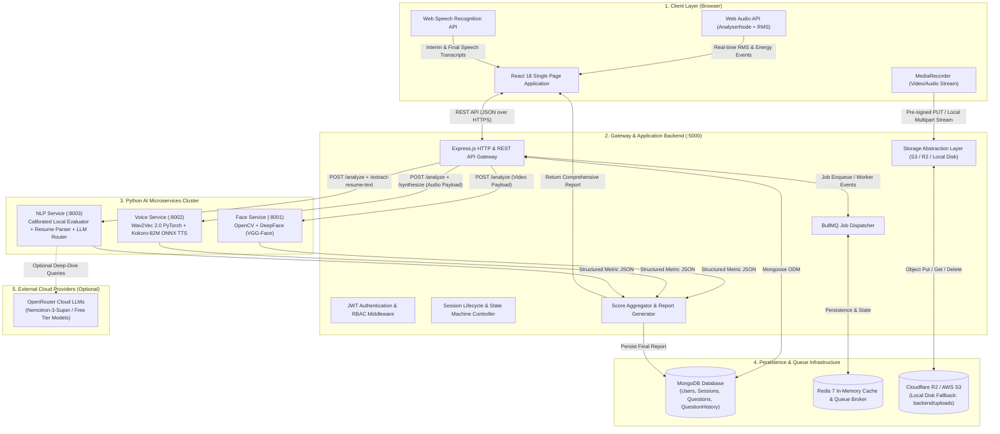
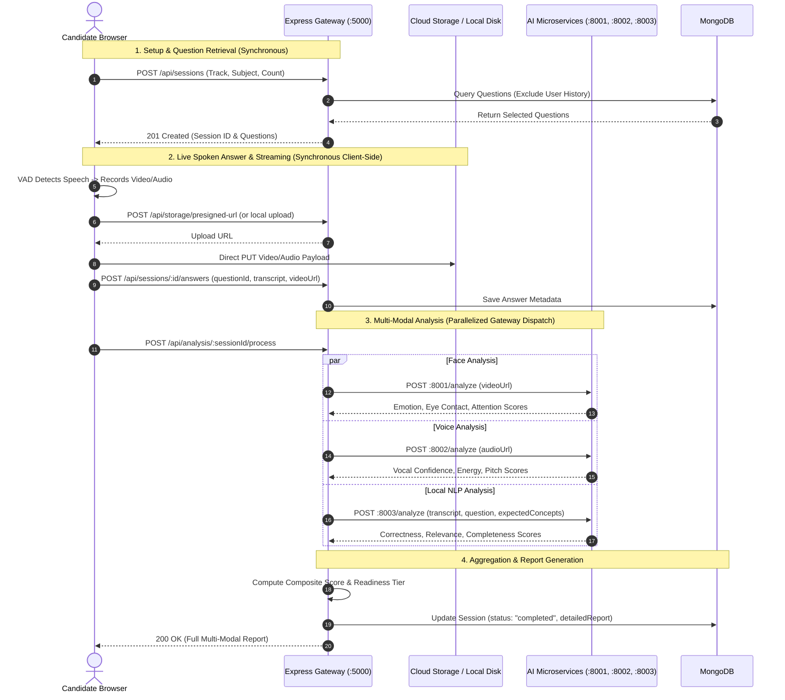

# System Architecture — InterviewAI

## 1. High-Level Architecture Overview

InterviewAI is a multi-service, multi-modal artificial intelligence platform designed to conduct natural, real-time technical and behavioral interviews. The platform evaluates candidates across three distinct modalities simultaneously: **facial dynamics (vision)**, **vocal prosody (speech emotion)**, and **conceptual correctness (natural language processing)**.

The system is built as an event-driven, decoupled microservices architecture with a centralized API gateway that orchestrates client state, persistence, media routing, and AI analysis.

---

## 2. Component Responsibilities

### 2.1 Client Layer (Frontend SPA)
- **Framework**: React 18, Vite, TailwindCSS, Zustand (Global State), React Router v6.
- **Role**:
  - Renders dynamic candidate/faculty views, camera preview, and live audio visualizers.
  - Manages real-time interview state transitions using a single-owner state machine.
  - Executes client-side Voice Activity Detection (VAD) via `useVoiceActivityDetector` hook to detect candidate speech onsets and barge-ins.
  - Captures video/audio chunks using `MediaRecorder` API and streams answers to storage endpoints.
  - Synthesizes spoken AI voice output via the backend Kokoro TTS proxy with seamless Web Speech API fallbacks.

### 2.2 API Gateway & Application Backend (`backend/`)
- **Runtime**: Node.js (ES Modules), Express.js.
- **Port**: `5000`.
- **Role**:
  - Exposes RESTful endpoints for authentication, session orchestration, question delivery, answer ingestion, and report generation.
  - Enforces JWT authentication stored in HTTP-only secure cookies with role-based access control (Student vs Faculty).
  - Handles question selection logic with per-user repetition tracking (`QuestionHistory`).
  - Abstracts media storage across Cloudflare R2, AWS S3, and local filesystem fallbacks.
  - Dispatches parallel analysis requests to the AI microservices cluster and aggregates multi-modal metrics.
  - Optionally hosts the compiled frontend SPA in single-origin mode (`SERVE_FRONTEND=true`) for campus LAN deployments.

### 2.3 AI Microservices Cluster (`ai-services/`)
- **Runtime**: Python 3.11+, FastAPI, Uvicorn.
- **Face Service (`:8001`)**:
  - Samples video frames at regular intervals using OpenCV.
  - Performs emotion classification (`happy`, `neutral`, `surprise`, `fear`, `sad`, `angry`, `disgust`) and eye-contact/attention geometry.
  - Verifies candidate identity against an optional baseline reference photo using DeepFace (VGG-Face) to detect face substitution.
- **Voice Service (`:8002`)**:
  - Analyzes audio waveforms using a fine-tuned Wav2Vec 2.0 Speech Emotion Recognition (SER) PyTorch model.
  - Synthesizes ultra-fast (<150ms) natural speech audio using an ONNX-accelerated Kokoro-82M neural engine.
- **NLP Service (`:8003`)**:
  - Evaluates candidate answers using a local, deterministic, calibrated evaluation engine (dual-pillar keyword + concept matching).
  - Enforces strict correctness gating to ensure factual errors, prompt echoes, and buzzword dumps receive genuine failing scores.
  - Parses PDF and DOCX resumes to extract skills and project descriptions.
  - Routes complex project questions to external LLMs (via OpenRouter) with automatic fallback to offline templates.

---

## 3. Communication & Data Flow

### 3.1 Synchronous vs Asynchronous Workflows

---

## 4. Security & Isolation Architecture

1. **Token Security**: Authentication uses stateless JWT tokens transmitted via `HttpOnly`, `SameSite=Lax` cookies, shielding against Cross-Site Scripting (XSS) attacks.
2. **API Rate Limiting**: Employs `express-rate-limit` with differentiated budgets:
   - Development mode: 50,000 requests / 15 min.
   - Cloud production: 300 requests / 15 min per IP.
   - Campus LAN deployment: Configurable via `RATE_LIMIT_MAX` to support hundreds of student clients sharing a single campus gateway IP.
3. **Data Isolation**: Each session is permanently bound to the owning user's `userId`. Session queries and analysis reports strictly enforce ownership verification.
4. **Media Ephemerality**: Temporary video/audio media stored during the interview is analyzed and automatically unlinked upon report generation to prevent disk exhaustion and respect candidate privacy.
