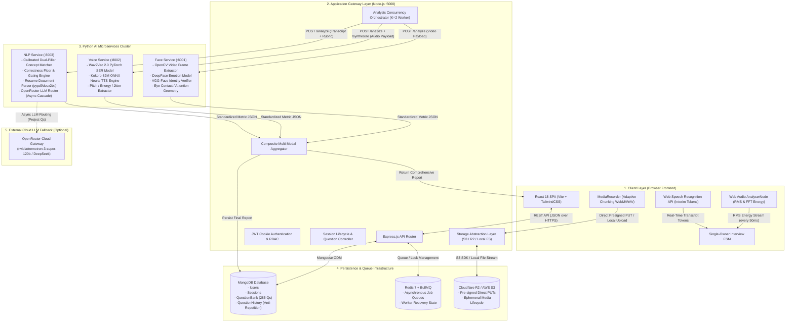
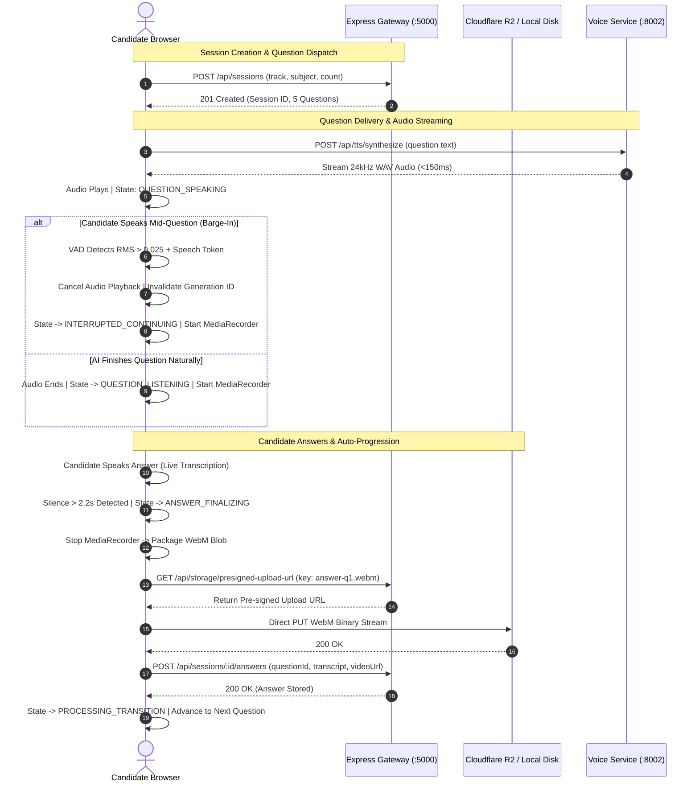
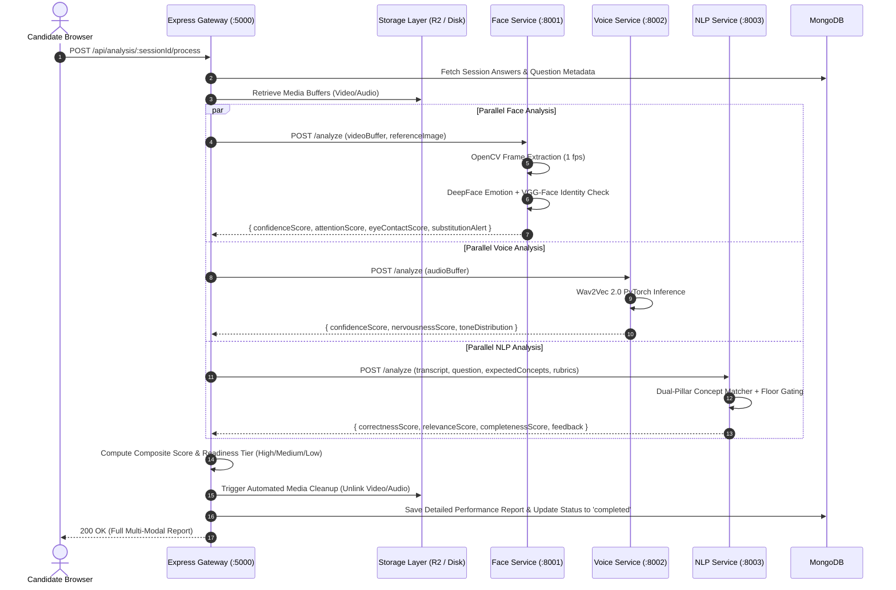

# Deep System Architecture & Engineering Blueprint — InterviewAI

## 1. Architectural Philosophy & Design Principles

InterviewAI is architected from the ground up as a **distributed, multi-modal, event-driven platform** that bridges real-time browser-based conversational interaction with asynchronous high-throughput machine learning inference. 

### Core Architectural Invariants:
1. **Decoupled Gateway & Specialized Microservices**: The Node.js/Express gateway manages state, authentication, session lifecycle, and media orchestration. It delegates computationally intensive deep learning tasks to dedicated Python FastAPI microservices running in isolated runtime environments.
2. **Deterministic Evaluation with Optional Semantic Extension**: Core scoring is handled by an ultra-fast, local, deterministic NLP engine with strict correctness bounds, supplemented by external LLMs only for open-ended project deep-dives.
3. **Single-Origin Deployment Parity**: The exact same application code runs in both multi-container cloud environments (via Docker Compose and Cloudflare R2) and air-gapped campus laboratories (via PM2 and local disk storage).
4. **Client-Side Latency Minimization**: Voice Activity Detection (VAD), interim speech transcription, and barge-in cutoffs are executed on the client's Web Audio / Web Speech thread, ensuring sub-150ms conversational response times.

---

## 2. End-to-End System Topology

---

## 3. Detailed Component Deep-Dive

### 3.1 Frontend Single-Owner Architecture (`frontend/src/`)
The frontend is engineered to handle intensive multi-threaded browser operations without frame drops:
- **Audio Processing Thread**: The `useVoiceActivityDetector` hook instantiates an `AudioContext` running an `AnalyserNode` with `fftSize = 512`. It samples audio RMS every 50ms to detect energy surges.
- **Speech Ingestion Thread**: Utilizes continuous `webkitSpeechRecognition` to produce real-time interim tokens for transcript confirmation, debouncing non-speech acoustic spikes.
- **Media Streaming**: `MediaRecorder` captures dual video/audio streams encoded in `video/webm;codecs=vp8,opus` or `video/webm;codecs=vp9,opus` at 30 FPS.
- **State Synchronization**: All component actions report to a central Finite State Machine in [`frontend/src/pages/LiveInterviewPage.jsx`](file:///C:/Workspace/Workspace/InterviewApp/frontend/src/pages/LiveInterviewPage.jsx) with atomic generation locks (`generationIdRef`) to eliminate race conditions.

### 3.2 Backend Gateway & Queue Management (`backend/`)
- **Express.js API Gateway**: Manages session creation, question filtering, answer metadata ingestion, and report delivery.
- **Controlled Concurrency Orchestrator**: In [`backend/services/analysisService.js`](file:///C:/Workspace/Workspace/InterviewApp/backend/services/analysisService.js), multi-modal analysis jobs are processed with worker concurrency caps ($K = 2$) to ensure machine resources are never overwhelmed during batch evaluation.
- **Ephemeral Media Lifecycle**: Once media buffers are consumed and evaluated by the AI microservices, the storage layer triggers an automated unlinking sweep to prevent disk accumulation.

### 3.3 The AI Microservices Cluster (`ai-services/`)
Each AI service is an independent FastAPI application running Uvicorn:
- **Face Analysis Microservice (Port `8001`)**:
  - Extracts frames at 1-second intervals using OpenCV.
  - Passes cropped face tensors through DeepFace to evaluate 7 discrete emotions.
  - Verifies facial landmarks and face pose to score gaze attention.
  - Compares candidate identity against the initial baseline snapshot using VGG-Face cosine distance to detect candidate substitution.
- **Voice Analysis Microservice (Port `8002`)**:
  - Ingests 16kHz mono WAV audio buffers.
  - Runs inference through a PyTorch Wav2Vec 2.0 Speech Emotion Recognition model (`best_model_path.pth`) to extract vocal confidence, jitter, and pitch stability.
  - Houses the Kokoro-82M ONNX Neural TTS engine (`kokoro_tts.py`) to synthesize 24kHz natural speech in $<150	ext{ms}$.
- **NLP Analysis Microservice (Port `8003`)**:
  - Implements a calibrated, dual-pillar keyword and concept matching algorithm with mathematical correctness floor gating.
  - Contains document parsers (`pypdf`, `docx2txt`) for extracting skills, architectures, and experiences from candidate resumes.
  - Integrates an OpenRouter LLM router with automated fallback cascade across free and commercial model tiers.

---

## 4. End-to-End Execution Sequence Diagrams

### 4.1 Live Conversational Interview Flow (Synchronous Client Execution)

### 4.2 Multi-Modal AI Evaluation Flow (Asynchronous Orchestration)

