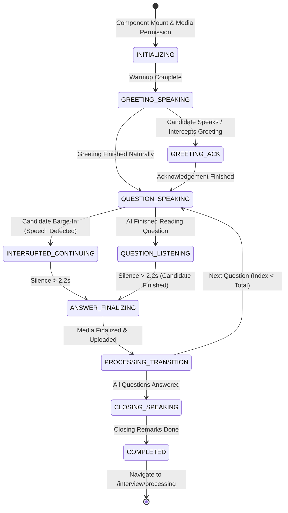
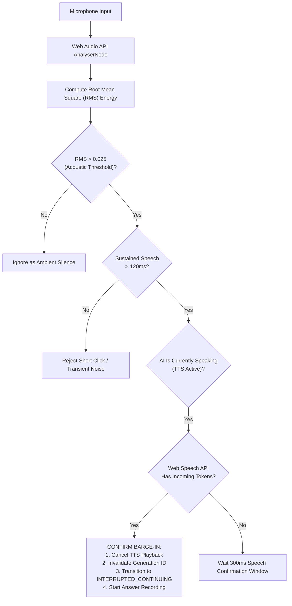

# Conversational Engine & State Machine — InterviewAI

## 1. Overview & Problem Definition

Standard online interview platforms operate in a turn-based "quiz" paradigm:
```text
Display Text -> User Clicks Record -> User Clicks Stop -> User Clicks Next
```

InterviewAI implements a **continuous, autonomous conversational state machine** that simulates an in-person human interviewer. The AI greets the candidate, reads questions naturally, listens for candidate speech onsets, immediately yields when interrupted (barge-in), detects answer completion via silence analysis, and automatically advances without manual button clicks.

---

## 2. The Single-Owner Interview State Machine

All interview lifecycle events are governed by an explicit Finite State Machine (FSM) implemented in [`frontend/src/pages/LiveInterviewPage.jsx`](file:///C:/Workspace/Workspace/InterviewApp/frontend/src/pages/LiveInterviewPage.jsx):



### State Definitions
| State | Description | Active Audio Mode |
| :--- | :--- | :--- |
| `INITIALIZING` | Requests webcam/mic permissions, warms up VAD audio context. | Audio context standby. |
| `GREETING_SPEAKING` | AI speaks opening greeting (e.g. *"Hello! Thanks for joining today's interview..."*). | TTS audio playing, VAD listening for candidate response. |
| `GREETING_ACK` | AI gives conversational acknowledgement (e.g. *"Great, let's get started!"*). | TTS audio playing. |
| `QUESTION_SPEAKING` | AI reads current question prompt aloud. | TTS audio playing, VAD active for barge-in detection. |
| `QUESTION_LISTENING` | AI is silent; candidate is speaking their answer. | MediaRecorder active, live transcription active, VAD silence timer running. |
| `INTERRUPTED_CONTINUING`| Candidate spoke while AI was speaking; AI stopped TTS immediately; candidate is answering. | MediaRecorder active, live transcription active. |
| `ANSWER_FINALIZING` | Candidate has ceased speaking for $> 2.2$ seconds. Audio/video buffers are sealed. | VAD idle, background upload streaming. |
| `PROCESSING_TRANSITION` | Answer metadata dispatched to backend; AI selects transition phrase (e.g. *"Understood. Moving on to the next question."*). | Transition TTS synthesized. |
| `CLOSING_SPEAKING` | AI delivers closing wrap-up phrase. | Closing TTS synthesized. |
| `COMPLETED` | Interview terminated cleanly. Redirects candidate to processing and report generation. | Media streams unmounted. |

---

## 3. Candidate Barge-In (Mid-Question Interruption)

### 3.1 The Acoustic & Speech Hybrid Confirmation Engine
Raw audio energy (RMS) alone cannot reliably distinguish human speech from ambient noise (car horns, dog barks, keyboard clatter). InterviewAI implements a **2-layer hybrid confirmation filter**:



### 3.2 Race-Condition Elimination via Generation IDs
A notorious bug in asynchronous browser audio is **stale callback invocation**: when TTS playback is cancelled, delayed `onend` or `onerror` events can accidentally trigger premature question transitions.

InterviewAI solves this with an atomic `generationIdRef`:
```javascript
// Each spoken sentence increments the generation ID
const currentGenId = ++generationIdRef.current;

await speak(text, {
  onStart: () => {
    if (generationIdRef.current !== currentGenId) return; // Stale start
  },
  onEnd: () => {
    if (generationIdRef.current !== currentGenId) return; // Discard stale completion
    handleNaturalSpeechCompletion();
  }
});
```
When `cancelTTS()` is triggered by a barge-in, `generationIdRef.current` is immediately incremented, turning all pending promises and callbacks into harmless no-ops.

---

## 4. Previous-Answer Continuation Logic

When a candidate finishes Question 1, the AI begins delivering Question 2. If the candidate suddenly remembers an additional point for Question 1 and interrupts Question 2, the system handles this contextually:

1. **Intent Classification**: Evaluates the candidate's transcript using [`classifyInterruption`](file:///C:/Workspace/Workspace/InterviewApp/frontend/src/utils/interviewConversationalPatterns.js).
2. **Context Preservation**: If candidate indicates answer continuation (e.g. *"Wait, also for the previous question..."*), the incoming transcript is appended to Question 1's transcript buffer.
3. **Graceful Recovery**: Once candidate stops speaking, Question 1 is sealed, and Question 2 is re-announced cleanly without corrupting the question index.
