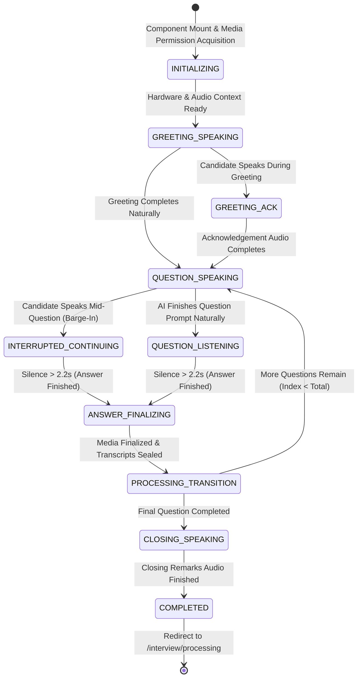
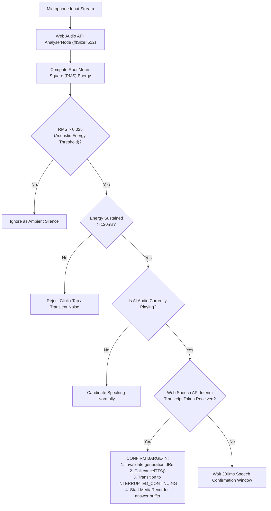

# Autonomous Conversational Engine & State Machine — InterviewAI

## 1. Overview & Problem Formulation

Traditional web interview applications operate on static, turn-based paradigms:
```text
Display Text Prompt ──► Click "Start Recording" ──► Click "Stop Recording" ──► Click "Next Question"
```

InterviewAI completely eliminates manual buttons, creating an **organic, continuous conversational experience**. The AI interviewer greets the candidate, articulates questions aloud with neural voices, continuously monitors the microphone, **yields immediately when the candidate interrupts (barge-in)**, monitors conversational cadence, detects answer completion through adaptive silence analysis, and automatically transitions between questions.

---

## 2. The Single-Owner Finite State Machine (FSM)

The entire interview room is governed by an explicit, deterministic Finite State Machine implemented in [`frontend/src/pages/LiveInterviewPage.jsx`](file:///C:/Workspace/Workspace/InterviewApp/frontend/src/pages/LiveInterviewPage.jsx):



### Complete State Transition Matrix

| Current State | Trigger / Event | Next State | Action Executed |
| :--- | :--- | :--- | :--- |
| `INITIALIZING` | Media streams initialized | `GREETING_SPEAKING` | Starts Kokoro TTS greeting; opens VAD listening channel. |
| `GREETING_SPEAKING` | Candidate speech confirmed | `GREETING_ACK` | Cancels greeting TTS; synthesizes dynamic acknowledgement phrase. |
| `GREETING_SPEAKING` | Greeting audio finishes | `QUESTION_SPEAKING` | Synthesizes first question prompt. |
| `GREETING_ACK` | Acknowledgement finishes | `QUESTION_SPEAKING` | Synthesizes first question prompt. |
| `QUESTION_SPEAKING` | Candidate speech confirmed | `INTERRUPTED_CONTINUING` | **Barge-in**: Instantly cancels TTS, invalidates generation ID, starts MediaRecorder. |
| `QUESTION_SPEAKING` | Question audio finishes | `QUESTION_LISTENING` | Starts MediaRecorder; activates silence detection timer. |
| `QUESTION_LISTENING` | Silence $> 2.2\text{s}$ & min duration $> 1.5\text{s}$ | `ANSWER_FINALIZING` | Stops MediaRecorder, seals WebM chunk, captures final transcript. |
| `INTERRUPTED_CONTINUING`| Silence $> 2.2\text{s}$ & min duration $> 1.5\text{s}$ | `ANSWER_FINALIZING` | Stops MediaRecorder, seals WebM chunk, captures final transcript. |
| `ANSWER_FINALIZING` | Media uploaded successfully | `PROCESSING_TRANSITION` | Dispatches answer metadata to `/api/sessions/:id/answers`. |
| `PROCESSING_TRANSITION` | Next question available | `QUESTION_SPEAKING` | Increments `currentQuestionIndex`; synthesizes transitional phrase. |
| `PROCESSING_TRANSITION` | Last question finished | `CLOSING_SPEAKING` | Synthesizes closing remarks (e.g. *"Thank you for your time..."*). |
| `CLOSING_SPEAKING` | Closing audio finishes | `COMPLETED` | Unmounts audio listeners; routes browser to `/interview/processing`. |

---

## 3. Real-Time Candidate Barge-In (<150ms)

### 3.1 The 2-Layer Hybrid Confirmation Filter
Microphone energy spikes (coughs, car horns, keyboard clicks) must never trigger false interruptions. The system uses a **2-layer acoustic + speech confirmation pipeline**:



### 3.2 Race-Condition Elimination via Generation IDs
When asynchronous audio is cancelled mid-playback, browser speech synthesis engines often emit delayed `onend` or `onerror` events several hundred milliseconds later. In naive implementations, this causes the interview to jump multiple questions ahead.

InterviewAI solves this with an atomic `generationIdRef` lock:
```javascript
// LiveInterviewPage.jsx - Generation ID Lock Pattern
const currentGenId = ++generationIdRef.current;

await speak(questionText, {
  onStart: () => {
    // Abort if a new generation was created while waiting for audio buffer
    if (generationIdRef.current !== currentGenId) return;
    setSpeaking(true);
  },
  onEnd: () => {
    // If the candidate interrupted, generationIdRef was incremented -> discard stale callback
    if (generationIdRef.current !== currentGenId) {
      trace("DISCARDING_STALE_TTS_ONEND", { currentGenId, active: generationIdRef.current });
      return;
    }
    handleQuestionSpeakingComplete();
  }
});
```

---

## 4. Previous-Answer Continuation & Conversational Intent Classification

If Question 2 begins playing and the candidate suddenly interrupts with: *"Wait, I also wanted to mention that RAID 5 requires minimum three disks"*, the system classifies the intent using [`classifyInterruption`](file:///C:/Workspace/Workspace/InterviewApp/frontend/src/utils/interviewConversationalPatterns.js):

| Interruption Category | Regex Patterns Detected | Engine Response |
| :--- | :--- | :--- |
| `ACKNOWLEDGEMENT` | `^(ok|okay|got it|sure|alright|yeah|yep|understood)` | Acknowledges briefly without disturbing question delivery. |
| `GENERAL_INTERRUPTION` | `(wait|hold on|give me a second|one sec|pause)` | Pauses question playback, waits for candidate ready state. |
| `ANSWER_CONTINUATION` | Technical keywords matching Question $N$ | Appends transcript buffer directly to Question $N$; re-delivers Question $N+1$ upon completion. |
| `DIRECT_ANSWER` | Candidate begins answering Question $N+1$ directly | Binds transcript buffer to Question $N+1$ and proceeds. |
