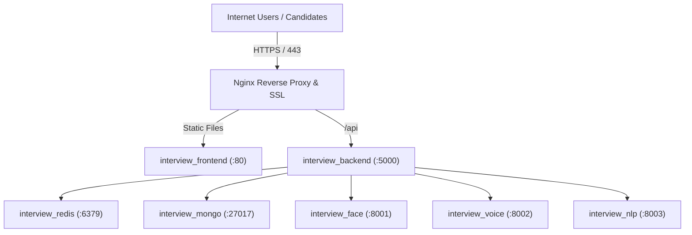

# Dual-Target Deployment Architecture — InterviewAI

InterviewAI features a **dual-deployment architecture**:
1. **Cloud Deployment (Docker Compose / VPS)** for scalable internet-facing deployments.
2. **College / Campus LAN Self-Hosting** for running entirely offline on a single laboratory desktop.

Both environments run the **exact same application codebase**; all deployment-specific behavior is controlled entirely by environment variables.

---

## 1. Cloud Production Deployment (Docker Compose)



### Quick Cloud Launch
```bash
# 1. Clone repository
git clone https://github.com/Noob-code7/InterviewApp.git
cd InterviewApp

# 2. Configure environment files
cp backend/.env.example backend/.env
cp ai-services/nlp-service/.env.example ai-services/nlp-service/.env
cp ai-services/voice-service/.env.example ai-services/voice-service/.env
cp ai-services/face-service/.env.example ai-services/face-service/.env

# 3. Launch all 7 containers
docker compose up -d --build
```

---

## 2. College LAN / Self-Hosted Deployment (PM2 + SPA Serving)

For university computer labs where internet access is restricted:
- Set `SERVE_FRONTEND=true` in `backend/.env`. The Node.js server serves the compiled React SPA directly from `frontend/dist`.
- Managed by PM2 via [`ecosystem.college.config.cjs`](file:///C:/Workspace/Workspace/InterviewApp/ecosystem.college.config.cjs) with automatic reboot recovery and health monitoring.

```powershell
# Deploy & start all services on Campus Lab PC (PowerShell)
.\scripts\deploy-college.ps1
```
