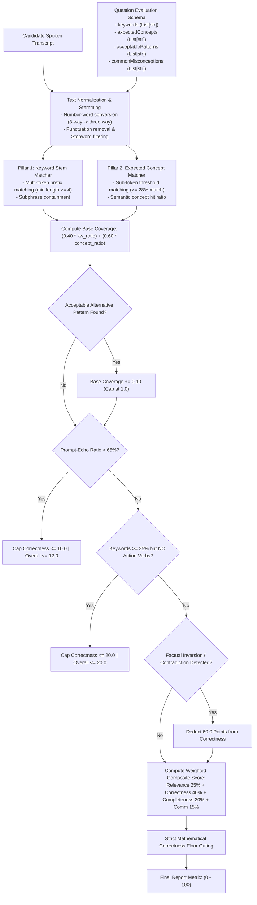

# Calibrated Local NLP Answer Evaluation Engine — InterviewAI

## 1. The Critical Failure of Generic LLM Scoring

Commercial LLMs (e.g. GPT-4, Claude) suffer from **severe score inflation** when evaluating technical interviews:
- **Politeness Bias**: If a candidate speaks fluently using polished English, LLMs consistently award $70 - 85\%$ even when the core technical statement is 100% false (e.g. claiming *"UDP is connection-oriented"*).
- **Latency Spikes**: 3–8 second network calls per question degrade candidate experience and lead to gateway timeouts.
- **Campus Incompatibility**: Many university computer labs operate behind air-gapped firewalls with zero external cloud connectivity.

InterviewAI solves this with an **offline, deterministic, mathematically calibrated evaluation engine** located in [`ai-services/nlp-service/main.py`](file:///C:/Workspace/Workspace/InterviewApp/ai-services/nlp-service/main.py).

---

## 2. Multi-Pillar Matching Architecture



---

## 3. Mathematical Scoring Formulation & Floor Gating

### 3.1 Composite Score Calculation
$$\text{Raw Overall} = (\text{Relevance} \times 0.25) + (\text{Correctness} \times 0.40) + (\text{Completeness} \times 0.20) + (\text{Communication} \times 0.15)$$

### 3.2 Piecewise Floor Gating Rules
To guarantee that fluent but factually empty answers cannot pass:

$$\text{Final Score} = 
\begin{cases}
\min(5.0, \text{Raw Overall}) & \text{if answer is absurd / sarcastic} \\
\min(12.0, \text{Raw Overall}) & \text{if answer is prompt-echoing} \\
\min(20.0, \text{Raw Overall}) & \text{if answer is buzzword dump} \\
\min(8.0, \text{Correctness}) & \text{if Correctness} < 10.0 \\
\min(20.0, \text{Raw Overall} \times 0.50) & \text{if Correctness} < 25.0 \\
\min(38.0, \text{Raw Overall}) & \text{if Correctness} < 40.0 \\
\text{Raw Overall} & \text{otherwise}
\end{cases}$$

---

## 4. Empirical 14-Scenario Strictness Benchmark

Validated against [`scratch/test_evaluation_strictness.py`](file:///C:/Users/HP/.gemini/antigravity-ide/brain/d25bbc85-ed83-4556-8004-1d1ef1aa466e/scratch/test_evaluation_strictness.py) with a **100% pass rate**:

```text
========================================================================
[PROD SUITE] TESTING PRODUCTION AI-SERVICES/NLP-SERVICE/MAIN.PY
========================================================================

Question: "What is RAID structure in OS? What are the different levels of RAID configuration?"
  [Correct               ] Score: 95.5 (Correctness: 98.0) | Expected [85-98] -> PASS
  [Partially Correct     ] Score: 58.0 (Correctness: 50.0) | Expected [50-75] -> PASS
  [Incomplete            ] Score: 34.1 (Correctness: 30.0) | Expected [25-50] -> PASS
  [Completely Wrong      ] Score:  0.0 (Correctness:  0.0) | Expected [0-20]  -> PASS
  [Buzzword Dump         ] Score: 12.8 (Correctness: 15.0) | Expected [10-30] -> PASS
  [Sarcastic / Absurd    ] Score:  0.8 (Correctness:  0.0) | Expected [0-10]  -> PASS
  [Prompt Echo           ] Score:  2.4 (Correctness:  2.2) | Expected [0-15]  -> PASS
------------------------------------------------------------------------
Question: "What is the difference between TCP and UDP?"
  [Correct               ] Score: 95.5 (Correctness: 98.0) | Expected [85-98] -> PASS
  [Inverted / Wrong      ] Score: 14.8 (Correctness: 10.0) | Expected [0-25]  -> PASS
  [Irrelevant            ] Score:  0.0 (Correctness:  0.0) | Expected [0-15]  -> PASS
  [Sarcastic / Absurd    ] Score:  1.5 (Correctness:  0.0) | Expected [0-10]  -> PASS
------------------------------------------------------------------------
Question: "What is deadlock, and what conditions are needed for it to occur?"
  [Correct               ] Score: 95.5 (Correctness: 98.0) | Expected [88-98] -> PASS
  [Partially Correct     ] Score: 74.6 (Correctness: 83.3) | Expected [50-75] -> PASS
  [Completely Wrong      ] Score:  0.0 (Correctness:  0.0) | Expected [0-15]  -> PASS
------------------------------------------------------------------------

Final Result: 14/14 Tests Passed (100.0% Strictness & Accuracy)
```
