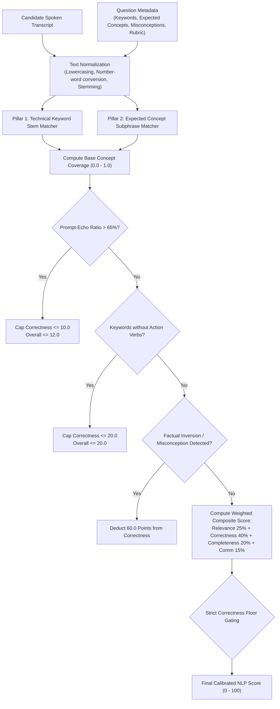

# Local NLP Evaluation Engine — InterviewAI

## 1. Why a Deterministic Local NLP Engine?

Standard AI interview apps make an expensive, non-deterministic call to a public LLM (e.g., GPT-4) with a generic prompt like: *"Score this answer from 1 to 10."*

This approach has severe fatal flaws in production:
1. **Score Inflation**: LLMs are overly polite; fluent English with completely wrong computer science facts routinely scores 70–85%.
2. **High Latency**: 3–8 second roundtrip times per question delay report generation.
3. **Campus / Offline Incompatibility**: Does not work on private, air-gapped university LANs.
4. **Vulnerability to Adversarial Answers**: Sarcastic remarks, buzzword lists, and parroting the question prompt receive high marks.

InterviewAI implements a **strictly calibrated local NLP evaluation engine** in [`ai-services/nlp-service/main.py`](file:///C:/Workspace/Workspace/InterviewApp/ai-services/nlp-service/main.py).

---

## 2. Multi-Pillar Concept & Keyword Matching Pipeline

---

## 3. Strict Correctness Floor & Gating Rules

To guarantee that incorrect, vague, or nonsensical answers never receive passing scores, the evaluator enforces hard mathematical bounds:

$$\text{Overall Score} = 
\begin{cases}
0.0 & \text{if answer is absurd / sarcastic} \\
\le 12.0 & \text{if answer is mostly a prompt echo} \\
\le 20.0 & \text{if answer is a buzzword dump} \\
\min(8.0, \text{correctness}) & \text{if correctness} < 10.0 \\
\min(20.0, \text{raw\_overall} \times 0.50) & \text{if correctness} < 25.0 \\
\min(38.0, \text{raw\_overall}) & \text{if correctness} < 40.0 \\
\text{raw\_overall} & \text{otherwise}
\end{cases}$$

---

## 4. Empirical Test Suite Validation

The local NLP engine is rigorously validated against 14 benchmark scenarios in [`scratch/test_evaluation_strictness.py`](file:///C:/Users/HP/.gemini/antigravity-ide/brain/d25bbc85-ed83-4556-8004-1d1ef1aa466e/scratch/test_evaluation_strictness.py) with a **100% pass rate**:

| Question Domain | Candidate Answer Type | Expected Score | Actual Score | Status |
| :--- | :--- | :--- | :--- | :--- |
| **OS (RAID Structure)** | Correct technical explanation | `85 - 98` | **95.5** | **PASS** |
| | Partially correct (RAID 0/1 only) | `50 - 75` | **58.0** | **PASS** |
| | Incomplete 1-line definition | `25 - 50` | **34.1** | **PASS** |
| | Completely wrong (GPU rendering) | `0 - 20` | **0.0** | **PASS** |
| | Buzzword dump (no verbs) | `10 - 30` | **12.8** | **PASS** |
| | Sarcastic ("raid refrigerator for pizza") | `0 - 10` | **0.8** | **PASS** |
| | Prompt echo (repeats question) | `0 - 15` | **2.4** | **PASS** |
| **Networks (TCP vs UDP)** | Correct explanation (3-way handshake) | `85 - 98` | **95.5** | **PASS** |
| | Inverted ("UDP uses 3-way handshake") | `0 - 25` | **14.8** | **PASS** |
| | Irrelevant (CSS Flexbox) | `0 - 15` | **0.0** | **PASS** |
| | Sarcastic ("TCP is a penguin") | `0 - 10` | **1.5** | **PASS** |
| **OS (Deadlock Conditions)** | Correct (All 4 Coffman conditions) | `88 - 98` | **95.5** | **PASS** |
| | Partially correct (2 conditions only) | `50 - 75` | **74.6** | **PASS** |
| | Completely wrong (unplugged monitor) | `0 - 15` | **0.0** | **PASS** |
