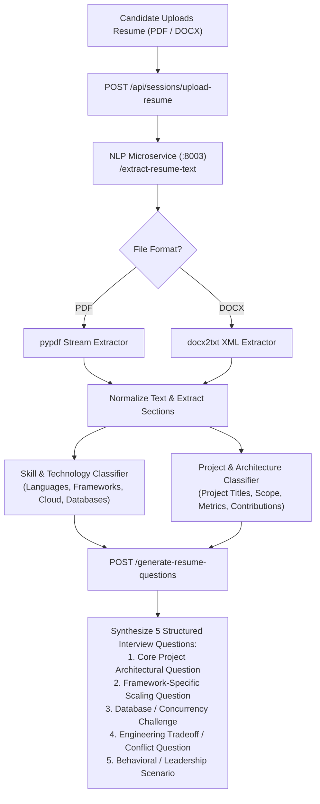

# Resume Intelligence & Personalized Question Synthesis — InterviewAI

## 1. Architecture Overview

InterviewAI allows candidates to upload resumes in PDF or DOCX format to synthesize personalized, project-specific technical interview questions:



---

## 2. Information Extraction Schema

The parser extracts structured JSON entities from unstructured text:
```json
{
  "skills": ["React", "Node.js", "MongoDB", "Redis", "Docker", "AWS", "FastAPI"],
  "experienceLevel": "Mid-Level (2-4 Years)",
  "projects": [
    {
      "name": "Distributed Task Queue System",
      "technologies": ["Node.js", "Redis", "BullMQ"],
      "highlights": "Processed 10,000 background jobs/sec with sliding-window rate limiting"
    }
  ]
}
```

---

## 3. Dynamic Question Generation Strategy

| Question Slot | Question Archetype | Example Resume-Derived Prompt |
| :--- | :--- | :--- |
| **Q1 (Role Overview)** | Architecture & Scope | *"Tell me about your role on the Distributed Task Queue System and how you structured the microservice boundaries."* |
| **Q2 (Deep Dive)** | Concurrency & Scaling | *"You mentioned using Redis and BullMQ for queue management. How did you handle worker concurrency and failure retries?"* |
| **Q3 (Tradeoffs)** | Technical Decisions | *"Why did you select MongoDB over a relational database for your session storage?"* |
| **Q4 (Problem Solving)**| Bottleneck Resolution | *"Describe a major performance bottleneck you encountered on this project and how you profiled and resolved it."* |
| **Q5 (Behavioral)** | Team Collaboration | *"Tell me about a time you had a technical disagreement with a teammate regarding system architecture."* |
