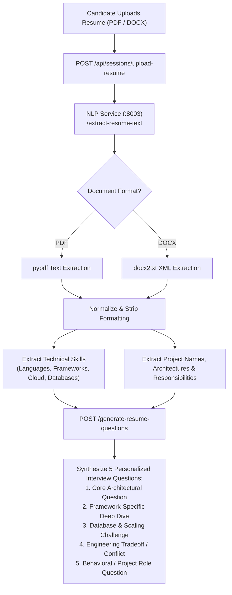

# Resume Intelligence & Personalized Interviewing — InterviewAI

## 1. Overview & Document Extraction

InterviewAI allows candidates to upload their resume (PDF or DOCX) to generate tailored, project-specific technical and architectural interview questions.



---

## 2. Information Extraction Schema

The parser extracts structured JSON entities from unstructured text:
```json
{
  "skills": ["React", "Node.js", "MongoDB", "Redis", "Docker", "AWS"],
  "experienceLevel": "Mid-Level (2-4 Years)",
  "projects": [
    {
      "name": "Distributed Task Queue System",
      "technologies": ["Node.js", "Redis", "BullMQ"],
      "highlights": "Handled 10,000 tasks/sec with sliding window rate limiting"
    }
  ]
}
```

---

## 3. Dynamic Question Personalization Strategy

| Question Number | Question Archetype | Example Resume-Derived Prompt |
| :--- | :--- | :--- |
| **Q1 (Warmup / Role)** | Project Overview | *"Tell me about your role on the Distributed Task Queue System and how you structured the architecture."* |
| **Q2 (Deep Dive)** | Concurrency & Scaling | *"You mentioned using Redis and BullMQ for task processing. How did you handle worker concurrency and failure retries?"* |
| **Q3 (Tradeoffs)** | Technical Decisions | *"Why did you select MongoDB over a relational database for your session storage?"* |
| **Q4 (Problem Solving)**| Production Bottlenecks| *"Describe a major performance bottleneck you encountered on this project and how you resolved it."* |
| **Q5 (Behavioral)** | Team Collaboration | *"Tell me about a time you had a technical disagreement with a teammate regarding system architecture."* |
