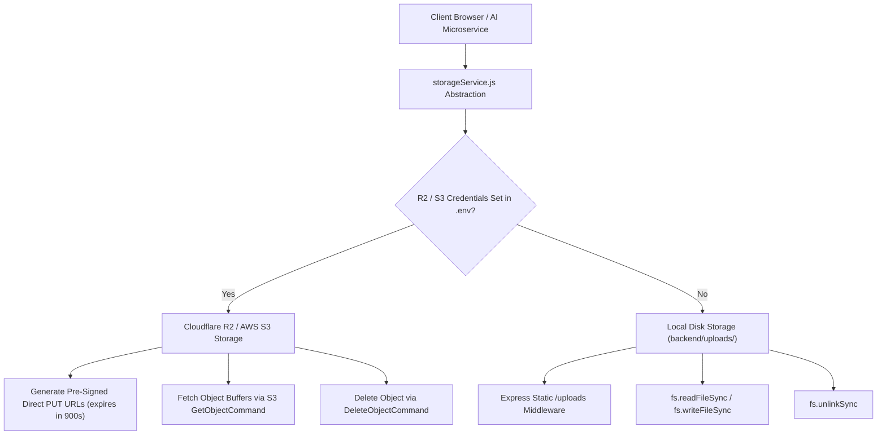
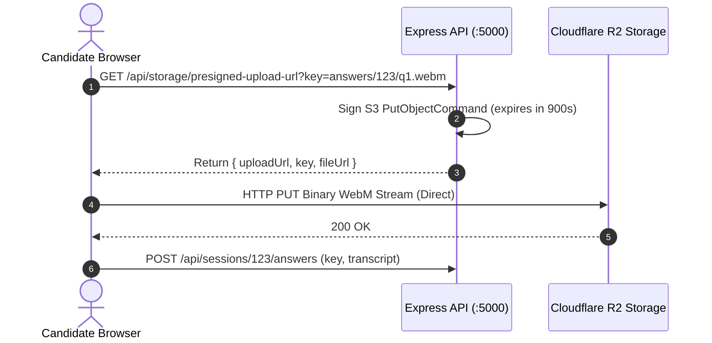

# Media Storage Abstraction & Ephemeral Lifecycle — InterviewAI

## 1. Storage Abstraction Architecture

InterviewAI implements a unified storage service in [`backend/services/storageService.js`](file:///C:/Workspace/Workspace/InterviewApp/backend/services/storageService.js) that operates transparently across both **Cloud Object Storage (Cloudflare R2 / AWS S3)** and **Local Filesystem Storage**:

---

## 2. Cloudflare R2 / AWS S3 Direct Upload Flow

In production cloud environments, client browsers upload large video/audio WebM recordings **directly to Cloudflare R2** via pre-signed PUT URLs. This keeps video upload traffic completely off the Node.js API gateway, preventing CPU starvation:

---

## 3. Ephemeral Media Lifecycle & Auto-Cleanup

Video files recorded during an interview are large (~10–30 MB per session). To prevent disk exhaustion:
1. Media is retained temporarily while the multi-modal analysis pipeline executes.
2. Once Face, Voice, and NLP analysis complete and scores are written to MongoDB, [`backend/services/storageService.js`](file:///C:/Workspace/Workspace/InterviewApp/backend/services/storageService.js) unlinks the raw video recordings from disk or deletes the object from R2.
